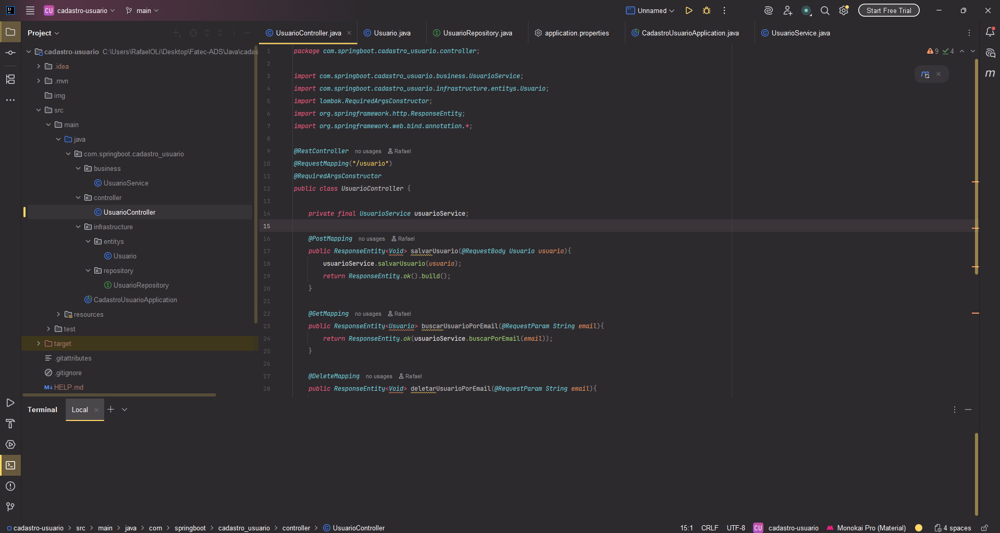
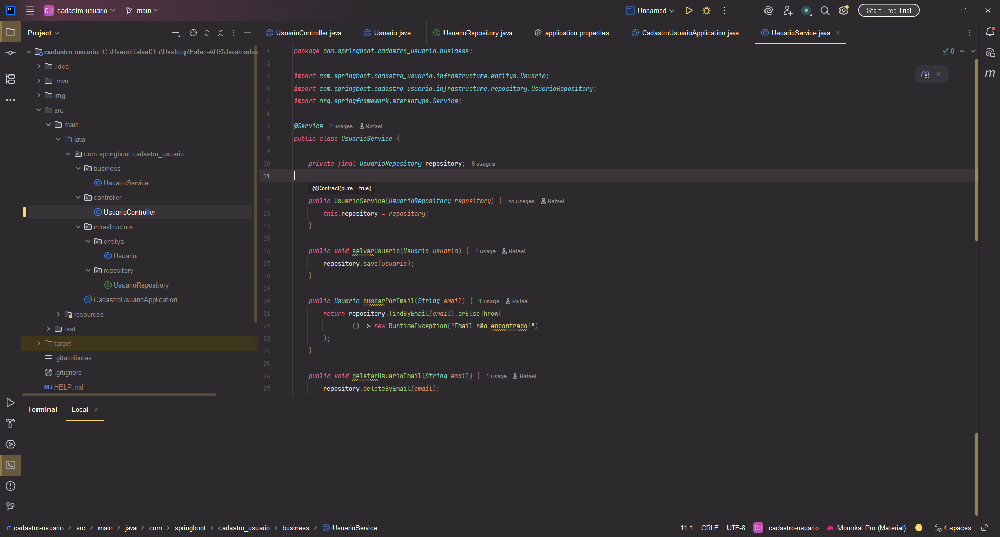
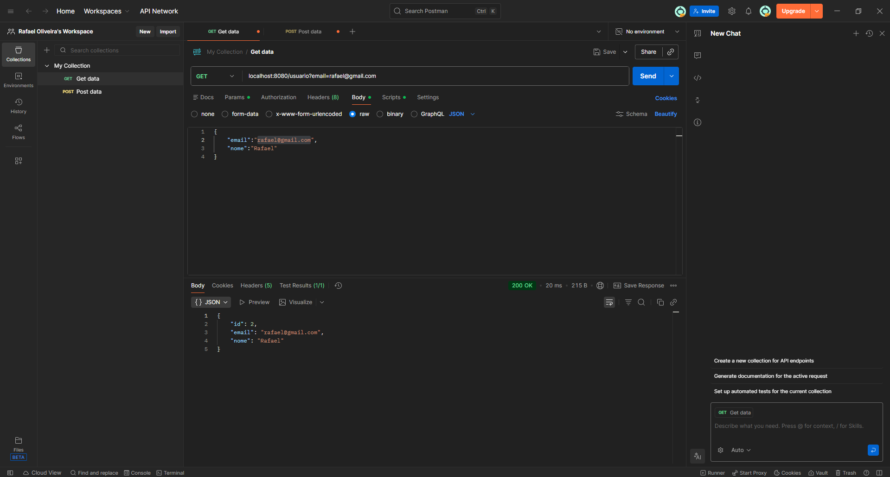

<h1 style="color: #50C878;">Spring Boot CRUD - Usuarios</h1>

<h3 style="color: #5F8575;">Aprendendo conceitos de Desenvolvimento de API com Java Spring Boot:</h3>

---

<h4>* Requisições HTTP (Get, Post, Put, Delete)</h4>
<h4>* Modelo Cliente-Servidor</h4>
<h4>* Anotações</h4>
<h4>* Controller</h4>
<h4>* Repository</h4>
<h4>* Service</h4>

---

<h3 style="color: #5F8575;">Tecnologias Utilizadas:</h3>

<h4>* Java</h4>
<h4>* Spring Boot</h4>
<h4>* Intellij</h4>
<h4>* Postman</h4>

---

<h3 style="color: #5F8575;">Imagens do Projeto:</h3>

<h2>Controller do usuário</h2>

---

<h2>Service do usuário</h2>

---

<h2>Postman - Requisições</h2>

---

